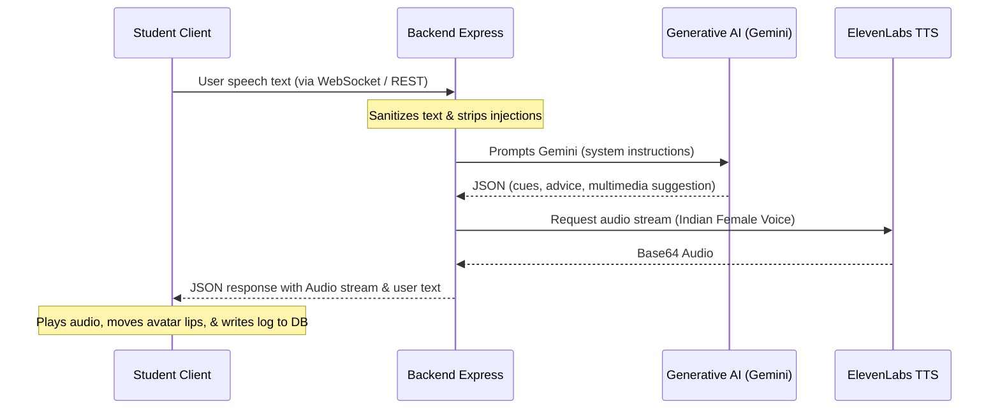

# Swasthya (स्वास्थ्य) - Mental Wellness Companion for Indian Entrance Exam Students

**Swasthya** (स्वास्थ्य) is an empathetic, real-time bidirectional mental wellness companion and daily journaling tracker built specifically for Indian competitive entrance exam students (preparing for JEE, NEET, UPSC, CA, etc.) who face severe academic stress, burnout, and performance anxiety.

Developed for the **Google for Developers PromptWars** hackathon.

---

## 🎯 Chosen Vertical: Student Mental Health & Academic Coping

Indian entrance examinations (like JEE, NEET, and UPSC) represent some of the most competitive tests globally. Students often study 10–14 hours daily in isolated environments, experiencing intense parental expectation and peer pressure. 

**Swasthya** targets this vertical by providing:
- **Instant Vocal Relief**: A hands-free talking avatar companion that listens and responds in a warm, colloquial Indian tone (incorporating comforting terms like *Beta*, *yaar*, and *bilkul*).
- **Aggregated Analytics**: A tracker that parses stress triggers (e.g., mock test scores, sleep fatigue, parental pressure) over time and highlights frequencies.
- **Physical Grounding exercises**: Direct suggestions for breathing routines, visual nature scenes, or guided exercises in real time.

---

## 🧠 Approach & Logic

### 1. Unified Real-Time Loop
We chose a **WebSocket-first architecture** to handle bidirectional audio-visual responses. When a user taps the microphone:
1. The client transcribes speech in real time.
2. The transcript is pushed over a WebSocket connection to the Node.js/Express server.
3. The server processes input using our **sanitization layer** (neutralizing script tags and prompt injection jailbreaks).
4. The backend sends the text to the **Generative AI cognitive layer** (via OpenRouter or native Google Gemini API), instructing the model to generate a strict JSON response.
5. The response is spoken by **ElevenLabs TTS** using an Indian accent model (Aditi) or falls back to Web Speech API `en-IN`.
6. The client updates the visual state cue of the counselor SVG (Empathetic Nod, Concerned Listen, Warm Smile) and appends the journal logs.



### 2. High-Contrast Indian Neo-Brutalist Aesthetic
Following the reference Kanban board look:
- Contrast ratio matches WCAG AAA standard (>15:1) for visual accessibility.
- Retro-modern styling using solid flat drop-shadows, chunky borders (`4px solid var(--border)`), and flat HSL accents.
- Responsive grid wraps from 3-columns on desktop to a single-column layout on mobile, keeping buttons, widgets, and form elements fully functional and un-squished.

---

## ⚙️ How the Solution Works

### Step 1: Onboarding Questionnaire
Upon first access, the student completes a short profile card stating their target exam, daily study habits, and current biggest worry. This generates an initial diagnostic wellness baseline.

### Step 2: Interactive Wellness Board (3 Columns)
1. **AAJ KA HAAL (Your Profile Status)**: Displays user parameters, primary stress triggers parsed from logs, trigger frequency counters, and history logs.
2. **DOST KI SALAH (Tailored Advice)**: Displays actionable coping strategies, mindfulness pauses, and motivational boosts.
3. **MANN KI SHANTI (Voice Companion)**: Features a responsive SVG Indian counselor (with bindi/jhumkas), live captions, microphone controls, and a multimedia suggestions frame containing guided video embeds, tranquil landscapes, or grounding GIFs.

---

## 📋 Assumptions Made

1. **Browser Capability**: Assumes the client browser supports the standard HTML5 Web Speech API (`webkitSpeechRecognition`) for local transcription and `speechSynthesis` for fallback audio.
2. **Supabase Authentication**: Assumes the database is running with standard email/password authentication or Google OAuth integration.
3. **Internet Connectivity**: Assumes connection is active; otherwise, the client shifts gracefully to offline rule-based classification and local browser speech synthesis.
4. **Environment Keys**: Assumes `OPENROUTER_API_KEY`, `ELEVENLABS_API_KEY`, and `GEMINI_API_KEY` are provided on the server.

---

## 🛠️ Installation & Setup

### Database Schema Setup
Run this inside your Supabase project SQL Editor to enable persistent mood history tracking:
```sql
create table mood_logs (
  id uuid default gen_random_uuid() primary key,
  user_id uuid references auth.users(id) on delete cascade,
  content text not null,
  mood text not null,
  stress_triggers text[] not null,
  coping_strategy text not null,
  mindfulness_exercise text not null,
  encouragement text not null,
  resource jsonb,
  created_at timestamp with time zone default timezone('utc'::text, now()) not null
);
```

### Running Locally
1. Clone the repository.
2. Configure **`backend/.env`**:
   ```env
   PORT=5000
   OPENROUTER_API_KEY=your-openrouter-key
   ELEVENLABS_API_KEY=your-elevenlabs-key
   GEMINI_API_KEY=your-gemini-key
   ```
3. Configure **`frontend/.env.local`**:
   ```env
   VITE_SUPABASE_URL=your-supabase-url
   VITE_SUPABASE_ANON_KEY=your-anon-key
   VITE_BACKEND_URL=localhost:5000
   ```
4. Install and Start:
   - **Backend**:
     ```bash
     cd backend
     npm install
     npm start
     ```
   - **Frontend**:
     ```bash
     cd frontend
     npm install
     npm run dev
     ```
